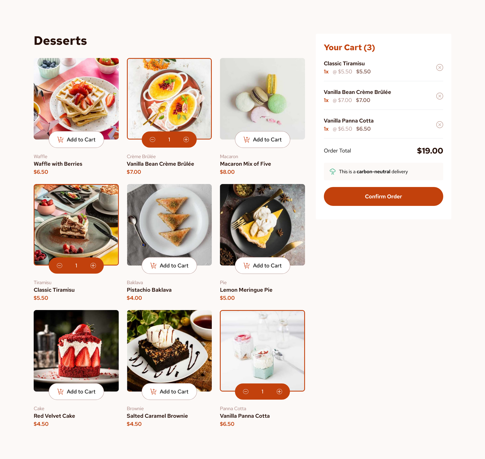

# Frontend Mentor - Product list with cart solution

This is a solution to the [Product list with cart challenge on Frontend Mentor](https://www.frontendmentor.io/challenges/product-list-with-cart-5MmqLVAp_d). Frontend Mentor challenges help you improve your coding skills by building realistic projects. 

## Table of contents

- [Overview](#overview)
  - [Screenshot](#screenshot)
  - [Links](#links)
- [My process](#my-process)
  - [Built with](#built-with)
  - [What I learned](#what-i-learned)
  - [Continued development](#continued-development)
  - [Useful resources](#useful-resources)
- [Author](#author)
- [Acknowledgments](#acknowledgments)

## Overview

### Screenshot




### Links

- Solution URL: [Solution here](https://github.com/MariaCMontO/product-list-cart)

## My process

### Built with

- Semantic HTML5 markup
- CSS custom properties
- Flexbox
- Grid
- Tailwind css
- Typescript
- React

### What I learned

With this project, I learned how to implement frameworks like react into my projects. I learned how to create components, include props and manage logic into them. I also learned how to include interaction with custom hooks like useCart.

```ts
import { useState } from "react";
import type { Product, ProductItem } from "../types";

export const useCart = () => {
  //Creamos el state que guarda los items del carrito
  const initialCart: ProductItem[] = [];
  const [cart, setCart] = useState(initialCart);

  const isEmpty = cart.length === 0;
  //Funciones que modifican el state

  function itemInCart(id: number): ProductItem | undefined {
    return cart.find((item) => item.id === id);
  }

  function addToCart(product: Product) {
    //Verficiar si ya existe el producto en el carrito
    const itemExist = cart.findIndex((item) => item.id === product.id);

    if (itemExist >= 0) {
      //existe
      const updatedCart = [...cart]; //Siempre trabajar sobre una copia del state
      updatedCart[itemExist].amount++;
      setCart(updatedCart);
    } else {
      //No existe
      const newItem = { ...product, amount: 1 };
      setCart([...cart, newItem]);
    }
  }

  function decreaseFromCart(product: ProductItem) {
    //Extraer el indice
    const index = cart.findIndex((item) => item.id === product.id);

    if (index >= 0) {
      let updatedCart = [...cart]; //Siempre trabajar sobre una copia del state
      updatedCart[index].amount--;
      if (updatedCart[index].amount === 0) {
        updatedCart = cart.filter((item) => item.id !== product.id);
      }
      setCart(updatedCart);
    }
  }

  function totalProduct(id: number) {
    const product = itemInCart(id);
    if (product) {
      return product?.price * product?.amount;
    }
  }

  function totalCart() {
    return cart.reduce((sum, item) => {
      return sum + item.price * item.amount;
    }, 0);
  }

  function deleteFromCart(product: ProductItem) {
    const updatedCart = cart.filter((item) => item.id !== product.id);
    setCart(updatedCart);
  }

  function restartCart() {
    setCart(initialCart);
  }

  return {
    cart,
    isEmpty,
    addToCart,
    itemInCart,
    totalProduct,
    decreaseFromCart,
    deleteFromCart,
    totalCart,
    restartCart
  };
};

```

### Continued development

I definitely want to keep developing interfaces with tailwind.css and react.

### Useful resources

## Author

- Frontend Mentor - [@MariaCMontO](https://github.com/MariaCMontO)


## Acknowledgments